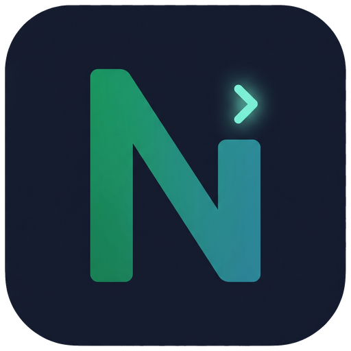

<p align="center">
  
</p>

<h1 align="center">nissia browser</h1>

<p align="center">
  <em>A token-cheap way for AI agents to browse the web</em>
</p>

<p align="center">
  <a href="LICENSE"></a>
  
</p>

---

**nissia browser** lets an AI coding agent (Claude Code, Codex, Cursor and others) use a real
web browser while spending very few tokens. It is a small command-line tool: your agent runs
simple commands and only the useful result comes back. No MCP server, no heavy screenshots,
and no API keys for everyday use. Works on **Windows, macOS and Linux**.

## Why it is cheap and fast
- It returns just the text or data you ask for, never whole pages or images.
- Whole flows run in one `nissia batch` (one connection, one round-trip) with adaptive waits.
- A full "operate a form and read the results" task is about **500–900 tokens and a few seconds**.
- Works with any agent that can run a shell command.

## The 3 modes
1. **Search** — quickly find things on the web and get a short list of results. The fastest.
2. **Navigate** — open a specific site and read or extract what you need (runs in the
   background, no window).
3. **Agent** — give it a goal: it searches, opens the best page, closes cookie and ad
   pop-ups, fills forms and reads the answer, in a real visible browser you can watch.

## What makes the Agent mode good
- **Closes the annoying stuff.** Cookie consent banners (OneTrust, Didomi, Sourcepoint,
  Quantcast, even the ones inside iframes) and ad pop-ups, so the page is readable.
- **Acts like a human.** Real mouse clicks (including calendar cells and grids via
  `click --sel`), human-paced scrolling and typing, natural referrers, and it keeps
  `navigator.webdriver` false **without** the flag that shows Chrome's "you are automated"
  banner — so sites do not treat it as a bot.
- **Recovers like a human.** If a page errors or half-loads, it can `reload` and retry.
- **Your browser, your choice.** Chrome, Edge, Brave or Opera (`nissia browser detect`).

## Install

nissia is a small `nissia` **binary** plus **instructions** for your agent. A pasted link installs
instructions, not a binary, so the binary step always happens once. Pick whichever is easier:

### Easiest: paste this repo's link to your AI agent
Paste `https://github.com/itielsefer23/nissia-browser` into **Claude Code, Cursor, or Codex** and say
*"install nissia browser"*. The agent reads this README and does it for you (it will ask before running
the installer, since that downloads and runs a script). Agents: follow **[For AI agents](#for-ai-agents-installing-this)** below.

### Or do it yourself (2 steps)
**1. Install the binary** (one line, no Rust needed):
```bash
# macOS / Linux
curl -fsSL https://raw.githubusercontent.com/itielsefer23/nissia-browser/master/install.sh | sh
# Windows (PowerShell)
irm https://raw.githubusercontent.com/itielsefer23/nissia-browser/master/install.ps1 | iex
```
**2. Wire it to your tool:**
- **Claude Code:** `/plugin marketplace add itielsefer23/nissia-browser` then `/plugin install nissia-browser@nissia`
- **Cursor / Codex / opencode / any shell agent:** run `nissia init` in your project (drops `AGENTS.md` + `.nissia/recipes.md`)

That's it. Run `nissia --help` to see everything. (Build from source instead: `git clone` the repo, then
`cargo install --path crates/nissia-cli`.)

### For AI agents installing this
A user pasted this repo and asked you to install nissia. Do exactly this:
1. Run `nissia --version`. If it prints a version, jump to step 4.
2. The binary is missing. **Ask the user to confirm** (it downloads and runs a script), then run the
   one-liner for their OS from step 1 above. Re-run `nissia --version`; if PATH hasn't refreshed, use the
   path the installer printed.
3. Set it up for the current tool:
   - **Claude Code:** copy the `skills/nissia-browser/` folder into the user's `~/.claude/skills/`
     (personal skills are auto-discovered) — or tell the user to run the two `/plugin` commands above.
   - **Cursor / Codex / opencode / other:** run `nissia init` in the project root.
4. Verify: `nissia browser detect` lists their browsers and `nissia search "test"` returns results. Done — tell the user.

## Quick examples
```bash
nissia search "best laptops 2026"             # quick web search
nissia browser detect                         # which browsers are installed
nissia snap https://example.com --focus main  # open a page, list clickable elements
nissia read https://example.com --focus main  # read a page as clean text
nissia dismiss                                # close cookie banners and pop-ups
nissia update                                 # check for a newer version
```
Run `nissia --help` to see everything.

## Updating
nissia tells you when a newer version is out: `nissia update --check` (cached for 24h, used by
the skill on startup). Run the installer again to upgrade, then re-copy the skill from this repo.

## After installing
- **Claude Code:** call `/nissia-browser` (or just ask it to search/browse). It asks which mode
  (Search / Navigate / Agent) and, for Agent mode, which browser, then runs nissia for you. Update the
  plugin with `/plugin update nissia-browser@nissia`.
- **Cursor / Codex / other:** the agent reads `AGENTS.md` and calls `nissia ...` directly; the full
  per-site playbook is in `.nissia/recipes.md`. Both are created by `nissia init`.

## Documentation
- [docs/GUIDE.md](docs/GUIDE.md) — complete guide: the 3 modes, browser selection and default,
  Agent mode, human navigation (mouse trajectory, typed search, read-scroll, pop-up closing),
  operating forms, batch, full command reference.
- [docs/TOKEN-ECONOMY.md](docs/TOKEN-ECONOMY.md) — how it keeps token cost tiny.
- [docs/SPEED.md](docs/SPEED.md) — performance numbers and how to stay fast.

## Optional extras
You don't need any of these. The defaults (DuckDuckGo search + you, the agent, driving) work
with no setup and no keys. These are only for specific cases:

- **SearXNG for better/unlimited search.** [SearXNG](https://github.com/searxng/searxng) is a
  free, open-source metasearch engine you run yourself (one Docker container). It aggregates
  Google, Bing, etc. and has no rate limits, so search results are richer than the default. Use
  it only if the built-in DuckDuckGo search isn't enough for you. To enable:
  1. Run an instance (e.g. `docker run -d -p 8888:8080 searxng/searxng`) and turn on the JSON
     output format in its `settings.yml`.
  2. Point nissia at it: set `NISSIA_SEARXNG_URL=http://localhost:8888` (or add
     `"searxng_url": "http://localhost:8888"` to `<data-dir>/search.json`).
  3. Select it: `NISSIA_SEARCH_PROVIDER=searxng nissia search "your query"`.
- **Hands-off agent (opt-in).** `nissia agent "<goal>"` runs a small internal LLM loop and prints
  only the final answer. It needs your own API key in `NISSIA_AGENT_API_KEY`; it is off by
  default and the normal search/navigate/agent modes never use it.

## Feedback
Ideas, comments and "this site didn't work" reports are very welcome and shape the skill:
- 💡 [Open a feedback issue](https://github.com/itielsefer23/nissia-browser/issues/new?template=feedback.yml) (structured form).
- 🐞 [Report a bug](https://github.com/itielsefer23/nissia-browser/issues/new?template=bug_report.yml).
- 💬 [Discussions](https://github.com/itielsefer23/nissia-browser/discussions) for free-form comments and questions.

## License
**MIT** — free to use, change and share, including in commercial projects. The only rule is to
keep the license and copyright notice. nissia is a fork of the MIT-licensed
[snact](https://github.com/vericontext/snact) project by Kiyeon Jeon, whose original copyright
is kept in [LICENSE](LICENSE) next to ours.
